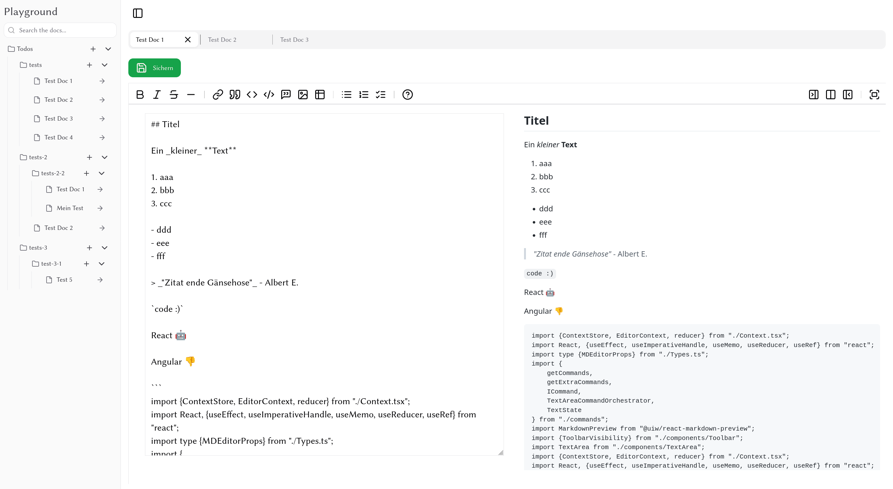

# Vite + React + TypeScript + Tailwind

React App zum erstellen und bearbeiten von Markdown Dokumenten. Dokumente und Ordner können beliebig erstellt werden.

Dokumente werden in einer Pocketbase instanz gespeichert.

### Simple Markdowneditor with Directory Structure

